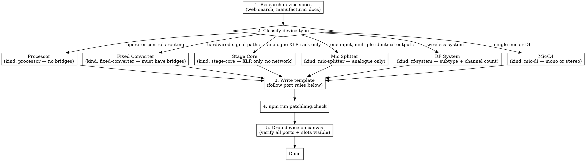

# Stock Library Builder

Build, edit, and audit device templates for the SignalCanvas stock library. Full rules are in `docs/STOCK_LIBRARY_BUILD_GUIDE.md` — read it before starting. This skill enforces the workflow.

## Device Taxonomy

| Kind | Signal | Key characteristic |
|------|--------|--------------------|
| `processor` | Any | Flexible internal routing — operator configures it |
| `fixed-converter` | Any | Pre-defined routing — always works the same way |
| `stage-core` | **Always analogue — XLR in, XLR out only** | Physical mic patching layer with per-slot metadata |
| `mic-splitter` | Analogue in → identical analogue outs | Inputs 1–N go identically to output A 1–N, B 1–N, C 1–N |
| `rf-system` | Wireless | Radio mic or IEM — quantity, direction, mono/stereo |
| `mic-di` | Analogue, mono or stereo | Single source; groups on canvas when many are displayed together |

**The Processor vs Fixed Converter test:** Can the operator change how inputs map to outputs? Yes → Processor. No, it always works the same pre-defined way → Fixed Converter.

**Stage Core is always analogue.** XLR in, XLR out only. No network ports.

**`kind: "device"` does not exist.** It was removed. Old saved projects with this value auto-migrate to `processor` on load. Never use it in new templates.

## Workflow



## Port Rules (Common Mistakes)

### Redundant ports: unique names, merged on load
Port names become interface IDs (`pl::Template::PortName`). Duplicate names = ID collision = broken rendering. Use `_Pri_`/`_Sec_` suffixes — the loader auto-merges matching pairs into a single interface with `redundant: true` and strips the suffix from the label.

```
# WRONG - duplicate names
Dante_In[1..64]: in(RJ45) [Dante]
Dante_In[1..64]: in(RJ45) [Dante, redundant]

# WRONG - unique names but no redundant tag (shows as two separate ports)
Dante_Pri_In[1..64]: in(RJ45) [Dante]
Dante_Sec_In[1..64]: in(RJ45) [Dante]

# CORRECT - unique names, redundant tag on secondary
# Loader merges into single "Dante In" interface with redundant: true
Dante_Pri_In[1..64]: in(RJ45) [Dante]
Dante_Sec_In[1..64]: in(RJ45) [Dante, redundant]
```

The merge matches by: same direction + same protocol set + same channel count. The primary keeps its ID, the label gets `_Pri`/`_Sec` stripped (e.g. "Dante Pri In" → "Dante In").

**Protocol tags must match between primary and secondary.** If the primary has `[Dante, AES67]`, the secondary must also include `AES67`: `[Dante, AES67, redundant]`. Mismatched protocols prevent the merge.

Patterns from existing stdlib: `_Pri_`/`_Sec_` (Dante, MADI), `_A`/`_B` (Q-LAN), `_Pri`/`_Sec` (AVB).

### Physical Connectors vs Virtual Channels

**Not every logical channel needs a physical connector port.**

When a device's outputs exist only as virtual channels on a network (Dante, MADI, AES67), and NOT as physical XLR/analog connectors, do NOT model them as separate `out()` ports.

**Bad pattern — phantom ports:**
```
# WRONG: Implies 32 physical XLR IEM outputs on the back of the Base Station
template Spectera_Base_Station {
  ports {
    Dante_Out[1..32]: out(RJ45) [Dante]
    IEM_Out[1..32]: out(XLR) [Analogue]  # ← These don't exist as physical connectors!
  }
}
```

**Correct pattern — virtual channels within the network:**
```
# CORRECT: Dante Out is the only physical output. Which channels are IEM
# vs mics is configured at runtime, not in the template.
template Spectera_Base_Station {
  ports {
    Dante_Pri_Out[1..32]: out(RJ45) [Dante]  # 32 virtual channels, configured per-instance
    Dante_Sec_Out[1..32]: out(RJ45) [Dante, redundant]
  }
}
```

**Rule of thumb:** If the hardware doesn't have a physical XLR/RJ45/BNC/fiber connector carrying that signal, don't model it as a port. If it's a virtual allocation of existing network capacity (Dante channels), leave that to per-instance configuration.

### Processors must NOT have bridges
Consoles and DSPs have user-configurable routing. Don't add `bridge` declarations — routing is configured on the canvas after placement.

**Exception — Tier-3 devices:** Tier-3 devices break the normal rules by design — they have behavioral semantics the builder cannot express (hardwired signal splits, ring semantics, protocol-flexible slots). These devices carry bridge declarations for signal tracing purposes. Do not remove them, and do not try to "fix" them to match the normal processor pattern.

Current Tier-3 devices: DiGiCo SD-Rack (OptoCore ring + fixed MADI splits), DiGiCo SD-series consoles (OptoCore → MADI routing), Yamaha RIVAGE DSP engines and RPio stageboxes (protocol-flexible HY/RY slots, auto-TX streams).

### Fixed Converters MUST have bridges
Stageboxes and format converters have hardwired paths. Research the actual product to determine which inputs feed which outputs.

**Exception — QLAN network devices (QSC QIO/SPA/CX amplifiers):** These are logically fixed-converters (QLAN ↔ analogue, hardwired) but are temporarily classified as `processor` because SignalCanvas cannot yet auto-generate QLAN streams at placement time. Do not change them to `fixed-converter` until that feature lands. Their bridge declarations are commented out in `qsc.patch` for when they're converted.

### Bridge channel allocation: verify the actual mapping, don't assume contiguous ranges

**The biggest source of bugs in tier-3 templates is collapsing reserved channel gaps.** Manufacturers commonly leave gaps in their network protocol channel allocations (for future expansion, ME mode, redundant streams, etc.). A spec sheet that says "128 channels gigaACE" rarely tells you that channels 49–64 are reserved between the mic preamps and the DX expansion ports.

**The pattern to watch for:**
1. Author reads "GX4816: 48 mic in, 32 ch DX1 in, 32 ch DX2 in"
2. Author sums them: 48 + 32 + 32 = 112 channels needed
3. Author writes contiguous bridges: `Mic_In → GX_Out[1..48]`, `DX_1_In → GX_Out[49..80]`, `DX_2_In → GX_Out[81..112]`
4. **Wrong**: actual A&H spec puts DX_1 at 65–96 and DX_2 at 97–128, with a deliberate gap at 49–64

The right places to find the actual allocation:
- **System guides / configuration manuals** — not the marketing one-pager. A&H's "DX & GX System Guide" has the channel-mapping table on a dedicated page; Yamaha's RIVAGE "Setup Guide" has equivalent tables; DiGiCo's "OptoCore" technical docs map channel slots to OptoCore frame positions.
- **Setup-time UI screenshots in the surface manual** — the surface's I/O patch page shows channel numbers next to physical ports.

When you find the mapping, **cite the source in a comment** on the bridge block so the next person can re-verify:

```
# gigaACE channel allocation per A&H DX & GX System Guide ISS_5 page 20:
#   Mic_In  → gigaACE 1..48
#   (gap)     gigaACE 49..64 reserved/unused
#   DX_1    → gigaACE 65..96
#   DX_2    → gigaACE 97..128
bridge Mic_In[1..48] -> GX_Out[1..48]
bridge DX_1_In[1..32] -> GX_Out[65..96]
bridge DX_2_In[1..32] -> GX_Out[97..128]
```

`npm run patchlang:check` validates *syntax* but cannot verify *semantic correctness* against the manufacturer's spec. Channel-mapping bugs ship until field-tested.

### Cascade ports: forward at an offset, not 1:1

When a device supports cascade mode (a second device daisy-chained via a passthrough port), the **first device's bridge must offset the cascaded device's channels** to the upper half of its uplink port. The cascaded device sends its signals on its own DX_A_Out ch 1..N (it doesn't know about the cascade); the first device's template is responsible for placing them at the offset position the surface expects.

**Example — DX168 cascade (per A&H DX & GX System Guide ISS_5 page 6):**

```
# WRONG — implicit 1:1 forwarding overwrites the first device's mics
bridge Mic_In -> DX_A_Out
bridge DX_Cascade_In -> DX_A_Out

# CORRECT — explicit offsets so the cascaded device's signals land at ch 17..32
bridge Mic_In[1..16] -> DX_A_Out[1..16]
bridge DX_Cascade_In[1..16] -> DX_A_Out[17..32]
bridge DX_A_In[17..24] -> DX_Cascade_Out[1..8]   # return path with output count cap
```

The return-path range (`DX_A_In[17..24] -> DX_Cascade_Out[1..8]`) reflects that cascaded DX168s only have 8 line outs, even though the cable carries 32 ch.

The same template handles both positions in the chain — the first instance has its `DX_Cascade` port wired to a downstream device, the second has it dangling. The bridges fire either way; they just have nothing to forward in the second-position case.

### Mode-dependent ports: pick the dominant mode and document the assumption

Some ports change channel count based on what's plugged in. Examples:
- **GX4816 DX2** — 32 ch in/out at 96 kHz when a DX expander is connected; 40 ch out only at 48 kHz when an ME-U/ME-1/ME-500 is connected (and only on SQ/Avantis, not dLive/AHM)
- **DiGiCo MADI ports** with sample-rate doubling — channel count halves at 96 kHz vs 48 kHz
- **DSP cards** that switch between mono/stereo allocations

PatchLang has no native way to express "this port's shape depends on what's downstream." Pick the **dominant mode** for your customer base (e.g., DX2 = 40 ch out for ME-mode users), declare it in the port shape, and add a comment:

```
DX_2_Out[1..40]: out(RJ45) [DX, dSNAKE, me_capable]
# DX_2_Out is declared as 40ch to capture ME-mode capacity. In normal DX
# mode this port is 32ch — channels 33..40 fall on the floor because no
# DX-protocol device exists with more than 32 outputs.
```

If both modes are equally common in your customer base, ship variant templates (`GX4816`, `GX4816_ME`) rather than picking one — but only when field reports demand it. Don't pre-emptively split.

### Cite the spec source on tier-3 templates

Tier-3 templates encode behavior the builder cannot express, so they're hand-authored from manufacturer documentation. **Add a comment at the top of the template citing the exact source** (document name, issue/version number, page number) so future audits can re-verify against the same authority:

```
template GX4816 {
  # Spec source: A&H DX & GX System Guide ISS_5, pages 6 (cascade) + 20 (gigaACE allocation)
  meta { ... }
}
```

When a manufacturer publishes a new revision (channel mapping changes, ME mode behavior expands, new firmware adds capabilities), the citation tells the next maintainer exactly which document to re-check.

### MADI is always 64 channels per connection
Each MADI connection (optical SFP or coax BNC) carries exactly 64 channels. Every MADI port **must** declare `[1..64]` — a bare port with no range is silently treated as 1 channel and will show no `×64` badge on the canvas.

Some devices have two mirrored coax outputs (same 64-channel stream on two BNC connectors). Model these as two separate named ports — not as `[1..2]` which would mean 2 channels total:

```
# WRONG — 2 channels total, not 2 connectors of 64
MADI_Coax_Out[1..2]: out(BNC_75) [MADI]

# CORRECT — two mirrored 64-channel outputs
MADI_Coax_Out_1[1..64]: out(BNC_75) [MADI]
MADI_Coax_Out_2[1..64]: out(BNC_75) [MADI]
```

### USB Audio ports require an explicit channel count
`USB: io(USB) [USB_Audio]` with no range is silently treated as 1 channel. Look up the actual USB audio channel count in the manufacturer's spec (it equals however many channels the device streams to/from a DAW) and declare it explicitly:

```
# WRONG — no channel count, renders as "USB" with no badge
USB: io(USB) [USB_Audio]

# CORRECT — 64 channels in both directions
USB[1..64]: io(USB) [USB_Audio]
```

The channel count on the USB port is what allows the mapping UI to assign channels when a user wires their computer to the device.

### AES3 is always 2 channels per connector
Each AES3 connector (XLR or BNC) carries exactly 2 channels. Port ranges reflect **channels**, not connectors. A device with 2 AES3 XLR outputs has 4 AES3 channels: `AES_Out[1..4]: out(XLR) [AES3]`.

**Switchable analogue/AES3 combo inputs:** Some devices pair XLRs so that two analogue mono inputs share a single AES3 slot. When set to AES3, only the first XLR of each pair is active and carries both channels; the second XLR is unused. The AES3 port's channel count equals the number of *active* connectors (half the total XLRs) × 2 — which equals the same stereo pair count as the analogue mode, not double it.

```
# Device with 4 XLR combo inputs (2 analogue pairs or 2 AES3 pairs):
Audio_In[1..4]: in(XLR) [Analogue]   # all 4 XLRs used, 4 mono channels
AES_In[1..4]: in(XLR) [AES3]         # only XLR 1+3 active, 2 connectors × 2ch = 4 channels
# NOT AES_In[1..8] — that would imply all 4 XLRs active in AES3 mode, which is wrong
```

### Dante vs AES67 tagging
Tag Dante ports as `[Dante]` only — never `[Dante, AES67]`. AES67 compatibility is a chipset-level feature, not a per-port protocol. Adding `AES67` to the port tag causes the system to treat the port as stream-based, breaking normal Dante channel display.

Instead, declare AES67 support via `dante_chipset` in meta:
- `Ultimo` — no AES67
- `Brooklyn_II`, `Brooklyn_3` — AES67 capable
- `Broadway`, `HC` — AES67 capable

### Direction model
| Split `in` + `out` | Dante, AES67, MADI, Analogue, AES3, SDI, SoundGrid, NDI, SMPTE2110, WordClock, Milan |
|---------------------|------|
| `io` (ring/bus) | OptoCore, TWINLANe, AVB, GigACE |

### Only document signal ports
Only include ports that carry audio or video signal. Do NOT include management, control, or network control ports (e.g., Ethernet management, GPIO, RS-232). If a port's only purpose is device configuration or monitoring, leave it out.

### RF Systems
- **No antenna ports.** Antenna workflows are out of scope. RF devices start at their audio outputs (analogue, AES, Dante) and audio inputs (for IEM transmitters). Do not model antenna, RF cascade, or antenna distribution ports.
- **Fixed channel count.** Most RF devices have a fixed channel count — a 4-channel receiver is always 4 channels. Use `rf_max_channels` to declare this. Only use `rf_min_channels` (with a value less than `rf_max_channels`) for the rare devices with truly flexible channel allocation (e.g., Shure AD-PSM, Sennheiser Spectera).
- **No bridges.** With antenna ports removed, RF devices don't need bridge declarations. The audio outputs are the device's signal outputs — there's no internal routing to model.

#### RF Subtype Reference

The `rf_subtype` meta key describes the device's RF role:

| Subtype | Direction | Example | Notes |
|---------|-----------|---------|-------|
| `radio-mic` | RX only | Shure AD4Q, Sennheiser EW-DX | Receives wireless mics; outputs audio to mixing console |
| `iem` | TX only | Shure PSM1000, Sennheiser SR IEM | Transmits IEM mixes to bodypacks; inputs audio from console |
| `bidirectional` | RX + TX | Sennheiser Spectera Base Station | Receives mics AND transmits IEM simultaneously; all audio I/O is shared (no separate "mic out" vs "IEM out" connectors) |

**Key distinction:** A bidirectional system's audio outputs and inputs serve dual purposes. Which Dante/MADI channels are mics vs IEM is configured per-instance, not expressed in the template.

#### IEM Channel Configuration: Flexible Mono vs Stereo Bodypack Modes

IEM transmitters allow users to dynamically configure each RF transmit channel as either **stereo** (1 bodypack receiving L+R mix) or **mono** (1 bodypack receiving 1-ch mix). This flexibility is per-instance, not per-template.

**How it works:**
1. Template declares the base audio inputs (e.g., `Audio_In[1..2]` for stereo sources or Dante streams)
2. At runtime, when user places the device on canvas, the device builder UI shows "IEM CHANNELS" with Add Stereo / Add Mono buttons
3. User builds the configuration by clicking buttons to add bodypacks
4. Each entry takes up capacity: stereo uses 2 audio channels, mono uses 1
5. This is stored per-instance in `iemChannelModes` (array of `'stereo' | 'mono'`), not in the template

**Example — PSM1000 P10T (single-channel IEM transmitter, fixed):**
```
template PSM1000_P10T {
  meta {
    manufacturer: "Shure"
    model: "PSM1000 P10T"
    category: "IEM Transmitter"
    kind: "rf-system"
    rf_subtype: "iem"
    rf_max_channels: 2  # Can be 1 stereo or 2 mono bodypacks
  }
  ports {
    Audio_In[1..2]: in(XLR) [Analogue]  # Stereo L+R inputs
    Loop_Out[1..2]: out(TRS_14) [Analogue]
  }
}
```

At runtime, user can configure:
- 1 Stereo bodypack (uses both audio inputs as L+R mix)
- 2 Mono bodypacks (input 1 = mix A, input 2 = mix B)
- Or mix: 1 Stereo + 0 Mono, etc.

**Multi-channel example — Sennheiser Spectera Base Station (bidirectional, 32-channel capacity):**

Template:
```
template Spectera_Base_Station {
  meta {
    manufacturer: "Sennheiser"
    model: "Spectera Base Station"
    kind: "rf-system"
    rf_subtype: "bidirectional"
    rf_max_channels: 32
  }
  ports {
    Dante_In[1..32]: in(etherCON) [Dante]   # TX: IEM mixes (32 channels)
    Dante_Out[1..32]: out(etherCON) [Dante]  # RX: Wireless mic channels (32)
  }
}
```

Users can configure per-instance:
- Channels 1–4: 2 Stereo bodypacks (4 audio channels)
- Channels 5–12: 8 Mono bodypacks (8 audio channels)
- Channels 13–32: 10 Stereo bodypacks (20 audio channels)
- Total: 32 audio channels used across 20 bodypacks

The template just provides the base capacity (32 channels); the runtime UI handles bodypack allocation per-instance.

#### `rf_max_channels` is a mono audio channel budget — stereo counts as 2, mono counts as 1

This is the most common mistake when building IEM templates.

**For radio mic receivers:** `rf_max_channels` = number of receiver channels (bodypacks the unit receives from). A 4-channel receiver = `rf_max_channels: 4`. Each receiver channel is mono, so count = number of bodypacks.

**For IEM transmitters:** `rf_max_channels` = total mono audio channel budget. Each stereo IEM feed costs 2; each mono IEM feed costs 1. A transmitter that supports 2 stereo IEM feeds = `rf_max_channels: 4`. A transmitter that supports 8 stereo IEM feeds = `rf_max_channels: 16`.

```
# WRONG — treating stereo pairs as the unit
template PSM1000_P10T {
  meta { rf_max_channels: 2 }   # ← wrong: 2 stereo pairs = 4 audio channels
}

# CORRECT — mono audio channel budget
template PSM1000_P10T {
  meta { rf_max_channels: 4 }   # ← 2 stereo × 2 channels each = 4
}
```

```
# WRONG — confusing L/R audio inputs with IEM channels
template SR_IEM_G4 {
  meta { rf_max_channels: 2 }   # ← wrong: there are 2 audio inputs, but only 1 IEM channel
  ports {
    Audio_In[1..2]: in(XLR) [Analogue]   # L + R feed into the one transmitter
  }
}

# CORRECT — SR IEM G4 is a single-channel transmitter (one frequency, one bodypack)
template SR_IEM_G4 {
  meta { rf_max_channels: 1 }   # ← 1 RF transmit channel
  ports {
    Audio_In[1..2]: in(XLR) [Analogue]   # L + R inputs still declared as 2 ports
    Loop_Out[1..2]: out(TRS_14) [Analogue]
  }
}
```

**IEM dual-mono note:** A single IEM transmitter channel can carry either a stereo mix OR two independent mono mixes (dual-mono). This is per-instance configuration, not a template concern. The 2x audio inputs on the transmitter support both modes — `rf_max_channels: 1` is still correct for a single-channel transmitter regardless of stereo/dual-mono capability.

### Connectors (Device Builder values only)
`XLR`, `RJ45`, `BNC_75`, `BNC_50`, `TRS_14`, `TRS_3`, `SpeakON`, `LC_Fiber`, `SC_Fiber`, `MTRJ_Fiber`, `TOSLINK`, `SFP`, `DB25`, `SDI_BNC`, `HDMI`, `USB`, `Euroblock`

- `BNC_75` — video (SDI) and wordclock (75-ohm)
- `BNC_50` — RF antenna connections (50-ohm, not currently used since antenna ports are out of scope)
- `TOSLINK` — consumer/prosumer optical audio connector, standard for ADAT lightpipe
- `Euroblock` — Phoenix/Euroblock screw-terminal connectors (common on installed AV and DSP devices)

If the real connector isn't in this list, flag it as a feature gap.

### Engine transparency (console_link)
When a surface connects to its DSP engine via a built-in backbone port (not an expansion card), add `console_link` to that port. This tells SignalCanvas the connection is transparent — no user-visible channel mapping.

```
# Built-in GigACE on dLive surface/MixRack — console_link
GigACE_Pri: io(RJ45) [GigACE, console_link]

# GigACE on an I/O Port CARD — NO console_link (generic audio transport)
GigACE_In[1..128]: in(RJ45) [GigACE]

# RIVAGE Console Network ports — console_link
Console_Network_In: in(RJ45) [Console_Link, console_link]
Console_Network_Out: out(RJ45) [Console_Link, console_link]
```

Key distinction: `console_link` goes on the **chassis-level** engine link, never on expansion cards that happen to use the same protocol.

### Card Slot Declaration

**Location:** Slot declarations go at the **template top level**, after the `ports { }` block. They are NOT nested inside a `slots { }` block.

**Syntax:**
```
template MyDevice {
  meta { ... }
  ports { ... }
  slot MY_Slot[1..3]: MY_Format
}
```

**Components:**
- `slot` — keyword
- `MY_Slot` — slot name (used for addressing in instances)
- `[1..3]` — range (how many slots of this type exist)
- `MY_Format` — format identifier (cards declare `fits: "MY_Format"` to match)

**Card matching:** The loader auto-resolves compatible cards by matching `fits` to slot format. Cards can be any template with `kind: "card"` and `fits: "FORMAT_NAME"`.

**Example — Video router with 32 I/O card slots:**
```
template EQX16 {
  meta {
    manufacturer: "Evertz"
    model: "EQX16"
    category: "Video Router"
  }
  ports { ... }
  slot IO_Slot[1..32]: IO_Slot
}
```

## User Device Builder Protocol Picker

The user-facing device builder (`DeviceInterfaceEditor.vue` → `TRANSPORT_PROTOCOLS` array) exposes a list of protocols a user can pick when authoring their own device. **Stdlib work sometimes requires deciding whether a protocol belongs in that picker.** A new tier-3 device might use a protocol no one else does; a field report might reveal users hitting roadblocks with a protocol they shouldn't have access to.

### Decision rule

> **Is this protocol only useful with tier-3 devices?**
> - **Yes** → remove from picker
> - **No** → keep in picker

"Only useful with tier-3 devices" means the protocol's *behavior* requires tier-3 modeling — channel allocation tables, mode shifts, surface-dependent capabilities, cascade offsets, ecosystem-bound interlock where a user-built device couldn't function without a tier-3 host that supplies allocation logic.

**Vendor-proprietary alone is NOT a reason to remove.** Many simple proprietary protocols (StageConnect, ULTRANET, AES50) carry plain N-channel point-to-point streams with sequential allocation. A user could build a new device using them tomorrow and it would actually work.

### Failure modes to avoid

- **Removing a protocol because "the vendor's flagship gear is tier-3."** This blocks users from adding simple new devices in the same ecosystem when the manufacturer ships something we haven't templated yet. The vendor's complex gear is irrelevant — what matters is whether the *protocol itself* requires tier-3 behavior.
- **Keeping a protocol because it's listed in some spec sheet.** If every real-world device using it is tier-3 (because of host-dependent allocation, cascade behavior, etc.), exposing it just lets users build broken approximations.

### Currently removed from picker (all A&H proprietary, all fail the test)

- `SLink` — not actually a transport protocol; it's a multi-protocol *socket type* on A&H surfaces (like picking "RJ45" instead of a protocol)
- `GigACE` / `GX` — reserved channel-allocation gaps that vary per surface (GX4816 leaves gigaACE 49–64 unused; the gap can't be expressed in builder UI without a channel-allocation editor)
- `DX` — cascade behavior with non-trivial channel offsets between first and second device in chain
- `dSNAKE` — host-specific channel allocation logic on iLive/GLD/SQ surfaces; even a "simple" AR2412-style stagebox is useless without the host

### Kept in picker despite vendor-proprietary nature

- `AES50` — Music Tribe (X32/Midas/Klark Teknik); structurally identical to MADI, sequential channels, no allocation surprises
- `StageConnect` — Music Tribe (Wing/M32C/newer DL stageboxes); plain 32-ch point-to-point
- `ULTRANET` — Behringer Powerplay personal monitor; receivers (P16-M, etc.) just consume a fixed 16-ch stream, no host-specific behavior

### When to apply the test

- Adding a new protocol to `typeCatalog.ts` (does it belong in the user picker too?)
- Auditing a tier-3 device template (does it use protocols the picker exposes that maybe shouldn't be there?)
- Field reports of "I built X with the builder but it doesn't work in my system" (the protocol might fail the test)

## Common Patterns

### Multi-Slot Optional Expansion

When a device has multiple independent expansion card slots (not daisy-chained), declare them as a range:

```
template Spectera_Base_Station {
  meta {
    manufacturer: "Sennheiser"
    model: "Spectera Base Station"
    kind: "rf-system"
    rf_subtype: "bidirectional"
  }
  ports {
    # Dante primary (required)
    Dante_Pri_In[1..32]: in(RJ45) [Dante]
    Dante_Pri_Out[1..32]: out(RJ45) [Dante]

    # Dante secondary (redundant backup)
    Dante_Sec_In[1..32]: in(RJ45) [Dante, redundant]
    Dante_Sec_Out[1..32]: out(RJ45) [Dante, redundant]

    # Word clock
    WordClock_In: in(BNC_75) [WordClock]
    WordClock_Out: out(BNC_75) [WordClock]
  }

  # Two independent MADI expansion slots
  # User can install BNC or OM (optical) cards in each
  slot MADI[1..2]: MADI_Expansion
}
```

Cards that fit this slot:
```
template Spectera_MADI_BNC {
  meta {
    manufacturer: "Sennheiser"
    model: "Spectera MADI Card (BNC)"
    kind: "card"
    fits: "MADI_Expansion"
  }
  ports {
    MADI_In[1..64]: in(BNC_75) [MADI]
    MADI_Out[1..64]: out(BNC_75) [MADI]
  }
}

template Spectera_MADI_OM {
  meta {
    manufacturer: "Sennheiser"
    model: "Spectera MADI Card (OM)"
    kind: "card"
    fits: "MADI_Expansion"
  }
  ports {
    MADI_In[1..64]: in(SC_Fiber) [MADI]
    MADI_Out[1..64]: out(SC_Fiber) [MADI]
  }
}
```

**At runtime,** when user places Spectera_Base_Station on canvas:
- Slot MADI[1] can hold Spectera_MADI_BNC or Spectera_MADI_OM
- Slot MADI[2] can hold Spectera_MADI_BNC or Spectera_MADI_OM
- User picks independently which card type (or none) for each slot
- All cards with `fits: "MADI_Expansion"` are available to choose from (future cards too)

This pattern is **flexible and forward-compatible**: if a new MADI card variant ships later, just add a new card template with `fits: "MADI_Expansion"` and users can select it immediately.

## Checklist

Run through before declaring any template done:

- [ ] Specs researched — channel counts and connectors verified against manufacturer docs
- [ ] **Every template corresponds to a real product** — do not add variant templates (e.g. a "Dante version") unless research explicitly confirms that variant exists. If unsure, omit it and flag the gap rather than inventing a device.
- [ ] Device type correct — see taxonomy above. Key: Stage Core = XLR only (no network), Fixed Converter = hardwired routing (must have bridges), Processor = flexible routing (no bridges except Tier-3 devices)
- [ ] For IEM transmitters: `rf_max_channels` = number of RF transmit channels (NOT audio input count)
- [ ] Signal ports only — no management, control, or network control ports
- [ ] Port names unique — especially redundant ports use `_Pri`/`_Sec` or `_A`/`_B` suffixes
- [ ] Direction model correct for each protocol
- [ ] **MADI ports all have `[1..64]` channel range** — bare `MADI_Port: in(SFP) [MADI]` is wrong; mirrored coax outputs are two separate named ports (`_1`/`_2`), not `[1..2]`
- [ ] **USB Audio ports have an explicit channel count** — `USB[1..N]: io(USB) [USB_Audio]` where N = the device's USB audio stream depth per direction
- [ ] Connectors match Device Builder dropdown values (BNC_50 for RF antennas, BNC_75 for video/wordclock)
- [ ] Template name is model-only (no manufacturer prefix)
- [ ] Card slots use established format names (MY_Slot, DMI_Slot, etc.)
- [ ] **Bridge channel ranges verified against the manufacturer's actual mapping table** — not just summary specs (channel totals are not enough, see "Bridge channel allocation" above)
- [ ] **Reserved/unused channel gaps preserved** — if the protocol leaves gaps between port allocations (e.g. gigaACE 49–64 on GX4816), those gaps must remain in the bridge ranges
- [ ] **Cascade ports use explicit channel offsets** — never rely on implicit 1:1 forwarding when a daisy-chained device's signals need to land at a non-1:1 position on the uplink
- [ ] **Mode-dependent port behavior documented** — if a port's channel count or direction varies by what's plugged in, pick the dominant mode and add a comment explaining the assumption
- [ ] **Tier-3 templates cite their spec source** — document name, issue/version, page number(s) — so future audits can re-verify
- [ ] **For new protocols: applied the picker test** — see "User Device Builder Protocol Picker" above. Decide whether the protocol belongs in the user-facing picker before adding tier-3 devices that depend on it
- [ ] `npm run patchlang:check <file>` passes
- [ ] Device dropped on canvas — all ports and card slots visible

## File Organization

| Type | Path |
|------|------|
| Audio devices | `src/data/stdlib/audio/{manufacturer}.patch` |
| Video devices | `src/data/stdlib/video/{manufacturer}.patch` |
| Expansion cards | `src/data/stdlib/cards/{manufacturer}-{slot-format}.patch` |
| Infrastructure | `src/data/stdlib/infrastructure/{manufacturer}.patch` |

Filenames: lowercase, hyphens for spaces (e.g. `allen-heath.patch`).
